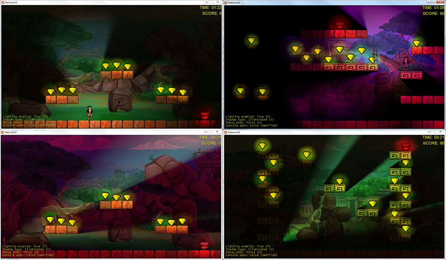
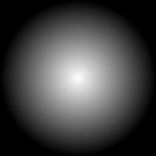
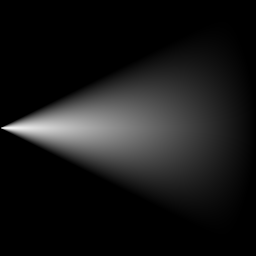
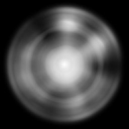
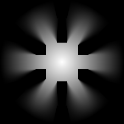
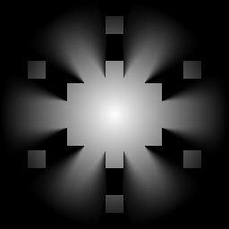

## What is this sorcery?

Penumbra allows users to easily add 2D lighting with shadowing effects to their games.

> Note that this project is no longer in development. I do try to fix any bugs though!



- https://www.youtube.com/watch?v=L9w9mEAb9gk&feature=youtu.be

## Getting Started

### Building source and samples

The following is required to successfully compile the Penumbra MonoGame solution:

- Visual studio 2015+ (due to C# 6 syntax)
- MonoGame 3.5.1+
- [DirectX End-User Runtimes (June 2010)](http://www.microsoft.com/en-us/download/details.aspx?id=8109) (to compile effect shaders)

### Using Penumbra

> Currently available only for MonoGame WindowsDX platform targeting .NET 4.5+!

Install the assembly through NuGet:

```powershell
Install-Package MonoGame.Penumbra.WindowsDX
```

In the game constructor, create the Penumbra component and add to components:
```cs
PenumbraComponent penumbra;

public Game1()
{
  // ...
  penumbra = new PenumbraComponent(this);
  Components.Add(penumbra);
}
```

In the game's `Draw` method, make sure to call `BeginDraw` before any other drawing takes place:

```cs
protected override void Draw(GameTime gameTime)
{
  penumbra.BeginDraw();
  GraphicsDevice.Clear(Color.CornflowerBlue);
  // Rest of the drawing calls to be affected by Penumbra ...
}
...
```

This will swap the render target to a custom texture so that the generated lightmap can be blended atop of it once `PenumbraComponent` is drawn.

By default, Penumbra operates in the same coordinate space as `SpriteBatch`. Custom coordinate space can be configured by setting:

```cs
penumbra.SpriteBatchTransformEnabled = false;
```

 Custom transform matrix is set through the `Transform` property.

### Working with lights

Penumbra supports three types of lights: `PointLight`, `Spotlight`, `TexturedLight`





While `PointLight` and `Spotlight` are generated on the shader, `TexturedLight` allows for more customization by requiring a custom texture used for lighting.

Lights provide three types of shadowing schemes: `ShadowType.Solid`, `ShadowType.Occluded`, `ShadowType.Illuminated`





To add a light:

```cs
penumbra.Lights.Add(light);
```

### Working with shadow hulls

Hulls are polygons from which shadows are cast. They are usually created using the same geometry as the scene and can be ordered both clockwise or counter-clockwise. Hull points can be manipulated through the `hull.Points` property.

For a hull to be valid and included in the shadow mask generation, it must conform to the following rules:

- Contain at least 3 points
- Points must form a simple polygon (polygon where no two edges intersect)

Hull validity can be checked through the `hull.Valid` property.

To add a hull:

```cs
penumbra.Hulls.Add(hull);
```

## Assemblies

- **MonoGame.Penumbra**: The core project for the lighting system.

## Samples

- **HelloPenumbra**: Simple sample which sets up bare basics of Penumbra with a single light source and shadow hull.
- **Platformer2D**: Penumbra lighting applied to [MonoGame Platformer2D samples game](https://github.com/MonoGame/MonoGame.Samples).
- **Sandbox**: Generic sandbox for testing out various different scenarios.
- **Common**: Supporting library providing common functionality for samples.
